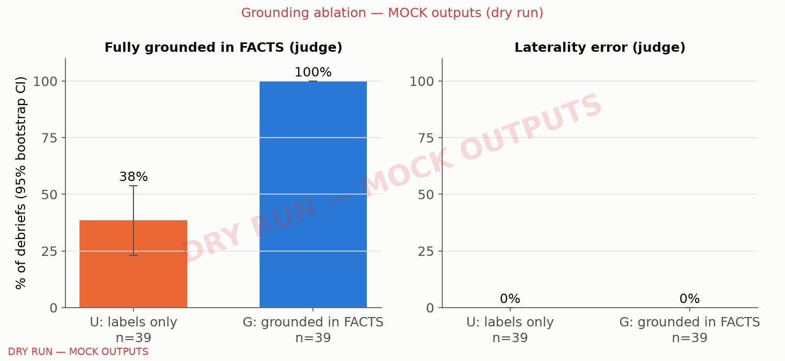

# Debrief faithfulness and grounding ablation — DRY RUN — mock model outputs, synthetic fixtures

> **DRY RUN.** G debriefs come from a mock client that returns the template debrief, U debriefs from a naive deterministic mock, and the judge is a deterministic stand-in built from eval/checks.py. These numbers test the harness only and must not be quoted.

## Headline

- Fully grounded (judge): G 100% [100–100], n=39 (Wilson 91–100) vs U 38% [23–54], n=39; paired difference G − U 0.62 [0.46–0.77], n=39.
- Laterality error (judge): G 0% [0–0], n=39 (Wilson 0–9) vs U 0% [0–0], n=39 (Wilson 0–9).
- Hallucinated findings per debrief (judge): G 0.00 [0.00–0.00], n=39 vs U 0.00 [0.00–0.00], n=39.
- Production validator, first try: G 100% [100–100], n=39 (Wilson 91–100); within one regeneration 100% [100–100], n=39 (Wilson 91–100); template fallback shown 0% [0–0], n=39 (Wilson 0–9).
- Scripted behaviours classified as intended by the production engines: 39/39.

## All metrics (unit = scenario; % or mean [95% CI])

| metric | U (labels only, 1 call) | G (first try) | G as shown (after validator/regen/fallback) |
|---|---|---|---|
| Schema-valid output (first try) | 100% [100–100], n=39 (Wilson 91–100) | 100% [100–100], n=39 (Wilson 91–100) | — |
| Production validator pass, first try | 3% [0–8], n=39 | 100% [100–100], n=39 (Wilson 91–100) | — |
| Model-written debrief passes within one regeneration | — | 100% [100–100], n=39 (Wilson 91–100) | — |
| Template fallback shown to learner | — | 0% [0–0], n=39 (Wilson 0–9) | — |
| A model call hit max_tokens or refused | 0% [0–0], n=39 (Wilson 0–9) | 0% [0–0], n=39 (Wilson 0–9) | — |
| Shown debrief passes the validator | — | — | 100% [100–100], n=39 (Wilson 91–100) |
| Judge: fully grounded in FACTS | 38% [23–54], n=39 | 100% [100–100], n=39 (Wilson 91–100) | 100% [100–100], n=39 (Wilson 91–100) |
| Judge: laterality error | 0% [0–0], n=39 (Wilson 0–9) | 0% [0–0], n=39 (Wilson 0–9) | 0% [0–0], n=39 (Wilson 0–9) |
| Judge: ≥1 hallucinated finding | 0% [0–0], n=39 (Wilson 0–9) | 0% [0–0], n=39 (Wilson 0–9) | 0% [0–0], n=39 (Wilson 0–9) |
| Judge: hallucinated findings per debrief | 0.00 [0.00–0.00], n=39 | 0.00 [0.00–0.00], n=39 | 0.00 [0.00–0.00], n=39 |
| Judge: pedagogy (1–5) | 2.77 [2.46–3.08], n=39 | 4.00 [4.00–4.00], n=39 | 4.00 [4.00–4.00], n=39 |
| Judge: management advice | 0% [0–0], n=39 (Wilson 0–9) | 0% [0–0], n=39 (Wilson 0–9) | 0% [0–0], n=39 (Wilson 0–9) |
| Deterministic: every result matches FACTS | 38% [23–54], n=39 | 100% [100–100], n=39 (Wilson 91–100) | 100% [100–100], n=39 (Wilson 91–100) |
| Deterministic: laterality error in where_to_look | 0% [0–0], n=39 (Wilson 0–9) | 0% [0–0], n=39 (Wilson 0–9) | 0% [0–0], n=39 (Wilson 0–9) |
| Deterministic: out-of-scope label mentioned | 0% [0–0], n=39 (Wilson 0–9) | 0% [0–0], n=39 (Wilson 0–9) | 0% [0–0], n=39 (Wilson 0–9) |
| Deterministic: banned management term | 0% [0–0], n=39 (Wilson 0–9) | 0% [0–0], n=39 (Wilson 0–9) | 0% [0–0], n=39 (Wilson 0–9) |
| Deterministic: within length limits | 100% [100–100], n=39 (Wilson 91–100) | 100% [100–100], n=39 (Wilson 91–100) | 100% [100–100], n=39 (Wilson 91–100) |

Paired differences G − U (same scenarios): grounded 0.62 [0.46–0.77], n=39; laterality_error 0.00 [0.00–0.00], n=39; hallucinated_per_debrief 0.00 [0.00–0.00], n=39; pedagogy 1.23 [0.92–1.54], n=39; det_results_ok 0.62 [0.46–0.77], n=39.

Judge failures (excluded from judge metrics): {'G': 0, 'U': 0, 'G_shown': 0}. Infrastructure failures (timeouts / API errors; excluded from every metric): {'G': 0, 'U': 0}. G template-fallback reasons: none.

## Groundedness by behaviour (judge; grounded/judged)

| behaviour | U | G |
|---|---|---|
| all_correct | 7/7 | 7/7 |
| wrong_side | 0/5 | 5/5 |
| mislabeled | 0/6 | 6/6 |
| missed_search | 5/6 | 6/6 |
| missed_recognition | 0/6 | 6/6 |
| missed_decision | 0/6 | 6/6 |
| overcall_normal | 3/3 | 3/3 |

## Scenarios

| behaviour | scenarios | engine classified as intended |
|---|---|---|
| all_correct | 7 | 7 |
| wrong_side | 5 | 5 |
| mislabeled | 6 | 6 |
| missed_search | 6 | 6 |
| missed_recognition | 6 | 6 |
| missed_decision | 6 | 6 |
| overcall_normal | 3 | 3 |

Skipped: {'needs a focal finding': 5, 'mirror point hits a finding or the target ROI': 1}.

## Method

- Cases: bench split; abnormal cases with 1–3 focal findings whose first focal label is core (stratified by that label), plus normal cases; 16 abnormal + 8 normal requested. The target of each behaviour is the case's first focal finding; every other focal finding is visited and marked correctly, and global findings are selected, so each scenario isolates one behaviour.
- Telemetry is scripted (synthetic input by design): 33 ms samples, zoom 1×; search = never within 1.3ρ of the target; recognition = a sweep with ≈500 ms inside the ROI; decision = ≈2,000 ms lingering.
- G: production tutor service with an injected caching client (the tutor's own debrief cache is bypassed). The first model call is the 'first try'; 'as shown' is what the learner would see.
- U: same model and output schema, ablation prompt (eval/ablation_prompt.md) with the same rules and teaching cards; the image shows only the learner's marks (expert outlines and finding-centred crops encode location, so they are withheld); CASE INFO gives label names, the learner's marks and selections — no locations, outcomes or search data. One call (a validator-guided regeneration would leak the ground truth). U therefore cannot know miss subtypes; 'every result matches FACTS' is reported for completeness, the headline is groundedness and laterality.
- Judge: claude-opus-5-5 with eval/judge_prompt.md and a structured-output schema; it sees FACTS and the debrief JSON only (no image), and is not told the condition.
- Deterministic checks: eval/checks.py, an independent re-implementation of SPEC §8.6 rules (not the production validator).
- CIs: percentile bootstrap over scenarios (1000 resamples, seed 0); paired differences bootstrap the per-scenario difference. Scenarios from the same case are not independent, so the CIs are somewhat optimistic.
- Review queue: 20 G debriefs stratified by behaviour → /Users/yashaswi/Downloads/blindspot/eval/samples/review_queue.dryrun.jsonl.

## Figure

## Provenance

- **generated:** 2026-10-06 02:31 UTC
- **git commit:** a66471d
- **command:** python -m faithfulness --dry-run --source fixtures
- **debrief_model:** claude-sonnet-5-5
- **judge_model:** claude-opus-5-5
- **debrief_params:** {'effort': 'low', 'max_tokens': 1200, 'source': 'backend.app.tutor.client (AnthropicTutorClient defaults)'} (G via production client; U mirrors)
- **judge_effort:** default
- **source:** fixtures — synthetic fixtures
- **n_scenarios:** 39
- **prices:** claude-api skill model table (cached 2026-09-25), read 2026-10-05; CLI-overridable with --price
- **spend:** $0.00 (dry run)
- `scoring`: backend.app.scoring.{hit,matching,outcomes,scores} (production)
- `search`: backend.app.search.{dwell,misstype,coverage,spatial} (production)
- `tutor.cards`: backend.app.tutor.cards.load_cards (production)
- `tutor.facts`: backend.app.tutor.facts.build_facts (production)
- `tutor.service`: backend.app.tutor.service.generate_debrief (production)
- `tutor.templates`: backend.app.tutor.templates.template_debrief (production)
- `tutor.validator`: backend.app.tutor.validator.validate (production)
