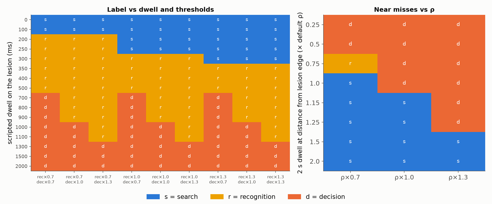

# Miss-type engine sanity check — synthetic scripted telemetry on ChestX-Det masks

> Scripted telemetry is a synthetic test input by design (it encodes an intended behaviour); these tables check the engine's logic, not learner behaviour.

## 1. Intended vs classified, end to end (default config)

All outcome targets (findings and marks) as intended in **153/153** scenarios across 37 cases.

| intended (target finding) \ classified | found | mislabeled | missed_search | missed_recognition | missed_decision | — |
|---|---|---|---|---|---|---|
| found | 30 | 0 | 0 | 0 | 0 | 0 |
| mislabeled | 0 | 30 | 0 | 0 | 0 | 0 |
| missed_decision | 0 | 0 | 0 | 0 | 22 | 0 |
| missed_recognition | 0 | 0 | 0 | 22 | 0 | 0 |
| missed_search | 0 | 0 | 42 | 0 | 0 | 0 |

Skipped scenario constructions: {"another finding lies inside the target's ROI margin": 32, 'mirror point hits a finding or the target ROI': 2}.

Measured target dwell at the default config (ms): decision: median 2046 (min 2046, max 2046, n=22); recognition: median 528 (min 495, max 528, n=22); search: median 0 (min 0, max 0, n=22).

## 2. Robustness: % of scripted misses classified as intended, across ρ and thresholds ±30%

27 configs (ρ, recognition and decision thresholds each at 0.7×, 1.0×, 1.3× of ρ = 0.035·W, 300 ms, 1000 ms).

| behaviour | scenarios | default config | mean over 27 configs | worst config | configs < 100% |
|---|---|---|---|---|---|
| search | 22 | 100% | 100% | 100% (all configs) | 0 |
| recognition | 22 | 100% | 99% | 95% (ρ×0.7 rec×1.3 dec×0.7) | 3 |
| decision | 22 | 100% | 100% | 100% (all configs) | 0 |

Configs where a scripted behaviour is not always classified as intended:

| behaviour | config | % as intended |
|---|---|---|
| recognition | ρ×0.7 rec×1.3 dec×0.7 | 95% |
| recognition | ρ×0.7 rec×1.3 dec×1.0 | 95% |
| recognition | ρ×0.7 rec×1.3 dec×1.3 | 95% |

## 3. Dwell duration vs label under threshold variants

Pointer lingering on the lesion for the scripted duration (30 findings each; cell = label counts, s/r/d = search/recognition/decision).

| scripted ms | rec×0.7 dec×0.7 | rec×0.7 dec×1.0 | rec×0.7 dec×1.3 | rec×1.0 dec×0.7 | rec×1.0 dec×1.0 | rec×1.0 dec×1.3 | rec×1.3 dec×0.7 | rec×1.3 dec×1.0 | rec×1.3 dec×1.3 |
|---|---|---|---|---|---|---|---|---|---|
| 0 | s30 | s30 | s30 | s30 | s30 | s30 | s30 | s30 | s30 |
| 100 | s30 | s30 | s30 | s30 | s30 | s30 | s30 | s30 | s30 |
| 200 | r30 | r30 | r30 | s30 | s30 | s30 | s30 | s30 | s30 |
| 250 | r30 | r30 | r30 | s30 | s30 | s30 | s30 | s30 | s30 |
| 300 | r30 | r30 | r30 | r30 | r30 | r30 | s30 | s30 | s30 |
| 350 | r30 | r30 | r30 | r30 | r30 | r30 | r30 | r30 | r30 |
| 400 | r30 | r30 | r30 | r30 | r30 | r30 | r30 | r30 | r30 |
| 500 | r30 | r30 | r30 | r30 | r30 | r30 | r30 | r30 | r30 |
| 700 | d30 | r30 | r30 | d30 | r30 | r30 | d30 | r30 | r30 |
| 800 | d30 | r30 | r30 | d30 | r30 | r30 | d30 | r30 | r30 |
| 900 | d30 | r30 | r30 | d30 | r30 | r30 | d30 | r30 | r30 |
| 1000 | d30 | d30 | r30 | d30 | d30 | r30 | d30 | d30 | r30 |
| 1100 | d30 | d30 | r30 | d30 | d30 | r30 | d30 | d30 | r30 |
| 1300 | d30 | d30 | d30 | d30 | d30 | d30 | d30 | d30 | d30 |
| 1500 | d30 | d30 | d30 | d30 | d30 | d30 | d30 | d30 | d30 |
| 2000 | d30 | d30 | d30 | d30 | d30 | d30 | d30 | d30 | d30 |

## 4. Near misses: 2 s of dwell at a distance from the lesion edge, under ρ ±30%

Distance in units of the default ρ (0.035·W). The ROI is the mask dilated by ρ, so attention just outside the ROI counts as 'never looked there'.

| distance (×ρ) | ρ×0.7 | ρ×1.0 | ρ×1.3 |
|---|---|---|---|
| 0.25 | d30 | d30 | d30 |
| 0.5 | d30 | d30 | d30 |
| 0.75 | s7 r19 d4 | d30 | d30 |
| 1.0 | s30 | d30 | d30 |
| 1.15 | s30 | s30 | d30 |
| 1.25 | s30 | s30 | d30 |
| 1.5 | s30 | s30 | s30 |
| 2.0 | s30 | s30 | s30 |

## Figure

## Takeaways

- The production engine classified 153/153 scripted behaviours as intended.
- Classification is a step function of dwell; ±30% threshold changes only move behaviours whose dwell sits near a boundary (see §3). The scripted 'recognition' pass (~500 ms) and 'decision' linger (~2 s) are far from the defaults, so §2 measures robustness of the scripts, while §3–§4 show where labels would flip.
- ρ matters for near misses: attention just outside the ROI is a 'search' error at the default ρ (see §4). Cursor and loupe dwell is a proxy for gaze; validation against eye tracking is roadmap work.

## Provenance

- **generated:** 2026-10-06 02:31 UTC
- **git commit:** a66471d
- **command:** python -m misstype_sensitivity --source data
- **source:** data — ChestX-Det cases (radiologist annotations)
- **n_cases:** 37
- **n_scenarios:** 153
- `scoring`: backend.app.scoring.{hit,matching,outcomes,scores} (production)
- `search`: backend.app.search.{dwell,misstype,coverage,spatial} (production)
- `search.dwell`: backend.app.search.dwell.dwell_ms (production)
- `search.misstype`: backend.app.search.misstype.miss_type (production)
