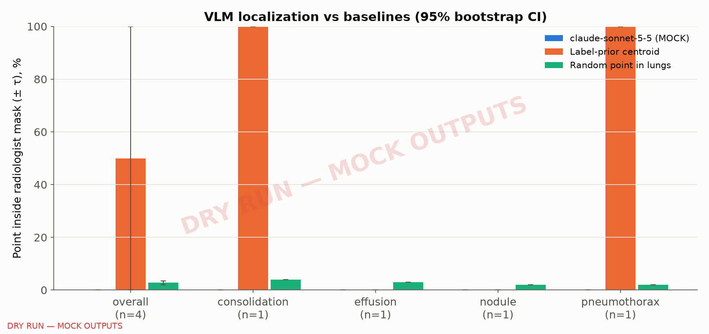
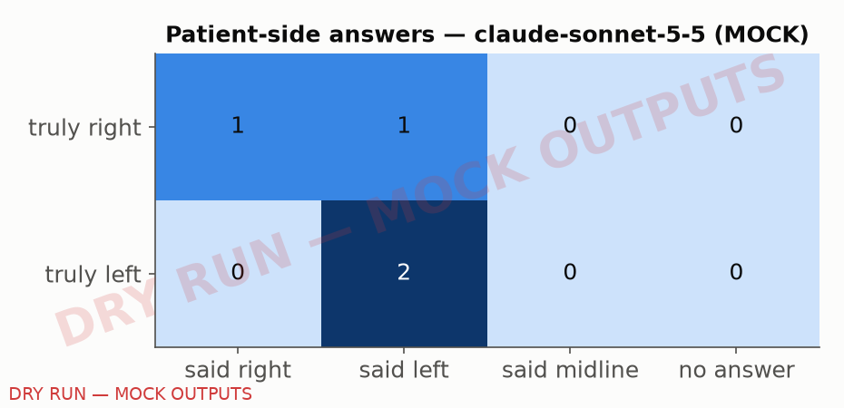

# VLM localization benchmark — DRY RUN — mock model outputs, synthetic fixtures

> **DRY RUN.** The 'model' column is a mock (label prior + Gaussian noise), not a VLM. These numbers test the harness only and must not be quoted.

## Headline

- claude-sonnet-5-5 (MOCK): point inside the radiologist mask (±τ) in 0% [0–0], n=4 (Wilson 0–49) of cases; label-prior baseline 50% [0–100], n=4; random point in the lungs 3% [2–4], n=4.
- Difference vs label prior (paired, cases): -0.50 [-1.00–0.00], n=4 (proportion points).
- Patient side correct: 75% [25–100], n=4; cell hit: 50% [0–100], n=4; primary zone: 25% [0–75], n=4.
- Invalid / refused / unparseable answers: 0 of 4 (none) — scored as misses.

## Results by label (point hit, % [95% CI])

| label | n | claude-sonnet-5-5 (MOCK) | Label-prior centroid | Random point in lungs |
|---|---|---|---|---|
| **overall** | 4 | 0% [0–0] | 50% [0–100] | 3% [2–4] |
| consolidation | 1 | 0% [0–0] | 100% [100–100] | 4% [4–4] |
| effusion | 1 | 0% [0–0] | 0% [0–0] | 3% [3–3] |
| nodule | 1 | 0% [0–0] | 0% [0–0] | 2% [2–2] |
| pneumothorax | 1 | 0% [0–0] | 100% [100–100] | 2% [2–2] |

## All metrics, overall

| method | Point hit | Cell hit | Patient side | Primary zone | median distance to centroid (× image width) |
|---|---|---|---|---|---|
| claude-sonnet-5-5 (MOCK) | 0% [0–0] (n=4) | 50% [0–100] (n=4) | 75% [25–100] (n=4) | 25% [0–75] (n=4) | 0.150 [0.052–0.259], n=4 |
| Label-prior centroid | 50% [0–100] (n=4) | 50% [0–100] (n=4) | 75% [25–100] (n=4) | 50% [0–100] (n=4) | 0.094 [0.000–0.238], n=4 |
| Random point in lungs | 3% [2–4] (n=4) | 10% [7–13] (n=4) | 50% [46–53] (n=4) | 19% [15–26] (n=4) | 0.405 [0.314–0.490], n=4 |

## Laterality

Rows: the finding's true patient side. Columns: the side the model stated. Patient right is displayed on the image left.

**claude-sonnet-5-5 (MOCK)**

| true \ said | right | left | midline | no answer |
|---|---|---|---|---|
| left | 0 | 2 | 0 | 0 |
| right | 1 | 1 | 0 | 0 |

Decomposition (does a wrong side come from pointing at the wrong half, or from naming the side with the image-left/patient-right convention reversed?):

| pattern | cases |
|---|---|
| point correct half, side correct | 3 |
| point wrong half, side wrong | 1 |

## Method

- Cases: bench split; exactly one focal finding, of a core label (SPEC §12.1); ≤ 25 per label, ≤ 200 total, seeded sample (seed 0); excluded qa flags ['negative_flag_mismatch', 'orientation_suspect'].
- Eligible bench cases per label, by selection rule: strict: {'consolidation': 1, 'effusion': 1, 'nodule': 1, 'pneumothorax': 1} (total 4); single-label: {'consolidation': 1, 'effusion': 2, 'nodule': 1, 'pneumothorax': 1} (total 5); labeled: {'consolidation': 1, 'effusion': 2, 'mass': 1, 'nodule': 2, 'pneumothorax': 1} (total 7).
- Lung mask for the random baseline: zones:lungs ×4.
- Prompt (structured output {cell, x, y, patient_side}): "This is a frontal chest radiograph with a reference grid (columns A–H, rows 1–8). A radiologist identified a {display} on this image. Return the grid cell containing its center, your estimate of its center in pixels (image {W}×{H}, x right, y down), and which side of the patient it is on."
- Grid: columns A–H left→right, rows 1–8 top→bottom, drawn on the image (no padding, so pixel coordinates are the image's own).
- Point hit: inside the instance mask dilated by τ = 0.02·W. Cell hit: the named cell intersects the undilated mask. Primary zone: the point lies inside the finding's primary zone (n/a when zones are approximate). Patient side: stated side equals the finding's side.
- Label prior: mean normalized centroid of that label in the ALL fixture cases (fixtures have no separate practice split, so the prior includes the test cases).
- Random in lungs: mean over 100 uniform draws from the lung mask per case.
- CIs: percentile bootstrap over cases, 1000 resamples, seed 0; paired differences bootstrap the per-case difference.
- Refusals, truncations and schema failures count as misses (no server-side model fallback, so every answer comes from the named model).

## Figures

## Provenance

- **generated:** 2026-10-06 02:31 UTC
- **git commit:** a66471d
- **command:** python -m vlm_localization --dry-run --source fixtures
- **models:** claude-sonnet-5-5
- **effort:** default
- **source:** fixtures — synthetic fixtures
- **n_cases:** 4
- **cache:** /Users/yashaswi/Downloads/blindspot/eval/cache/vlm/mock
- **prices:** claude-api skill model table (cached 2026-09-25), read 2026-10-05; CLI-overridable with --price
- **spend:** $0.00 (dry run)

## Interpretation

Report the number as it is. Even a strong localization score would not make a VLM a source of truth for a tutor: Blindspot's truth comes from radiologist annotations by construction (RESEARCH.md §4).
